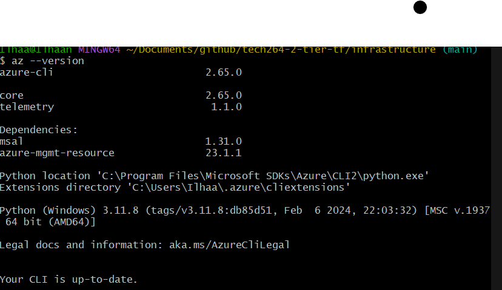
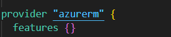
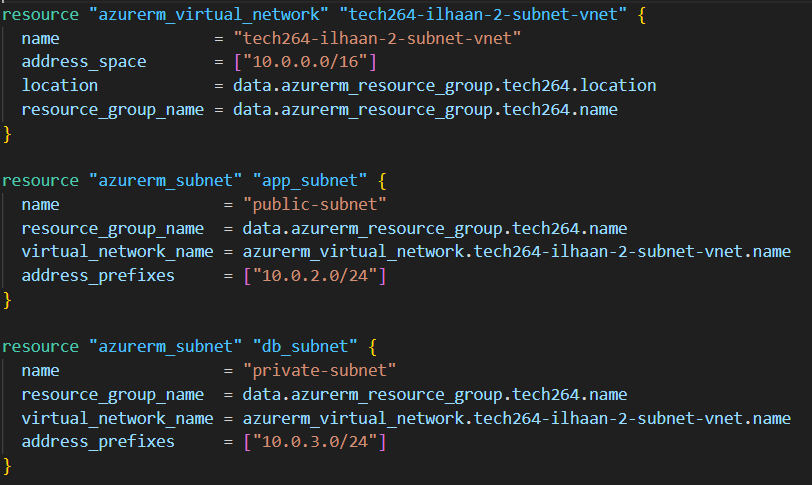

# ***DEPLOYING IN TERRAFORM***
- [***DEPLOYING IN TERRAFORM***](#deploying-in-terraform)
  - [***Creating a 2-tier architecture app in Azure using Terraform***](#creating-a-2-tier-architecture-app-in-azure-using-terraform)
    - [***Pre-requisites***](#pre-requisites)
    - [***Steps***](#steps)
      - [***Confirgure your VNet and subnets***](#confirgure-your-vnet-and-subnets)

## ***Creating a 2-tier architecture app in Azure using Terraform***
### ***Pre-requisites***
- Download Terraform, make sure it is the correct version for your OS (https://developer.hashicorp.com/terraform/install)
- Download Azure CLI  (https://learn.microsoft.com/en-us/cli/azure/install-azure-cli-windows?tabs=azure-cli)
  - make sure you run the `az login` in the **windows powershell**, will not work in a **git bash** window
  - Add location of Azure CLI in your local machine, to your **PATH** env variable so you can call it from anywhere in your home directory, you can check this by running ***`az --version`***. The output should look like this:
 

 

- Your existing azure resource group (not creating a new one)

### ***Steps***

1. Create a folder in  your github folder to house your project, name appropriately (i.e: `tech264-2-tier-tf`)
**`mkdir tech264-2-tier-tf`**
2. Create a `main.tf` file and a `variable.tf` file and a `.gitignore` file
3. Inside your `main.tf` file, specify your provider:
 

 

#### ***Confirgure your VNet and subnets***
4. Add your resource with the correct terraform tag to reference the virtual network in Azure 
5. Create your subnet, ensure your CIDR blocks are accurate and reference the correct the resource group
 

